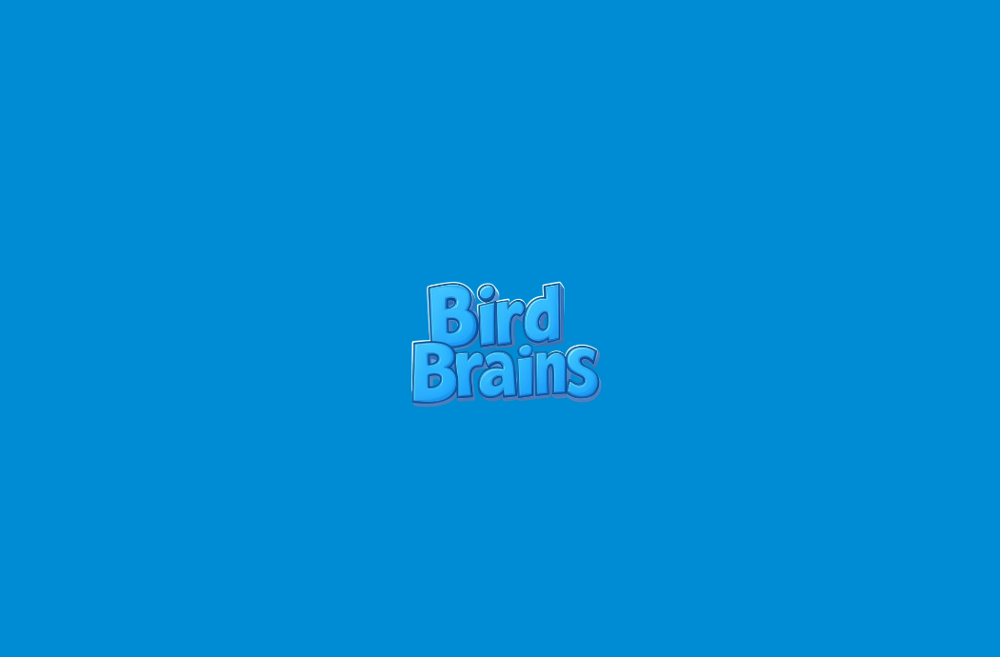

# 🧠 Brain Birds - A Farcaster Mini App



Brain Birds is a simple, fun memory game built as a Farcaster Mini App. Flip cards, match pairs, and challenge your memory.

This project is part of my learning journey in building with the Farcaster Mini App SDK. It's lightweight, fast, and designed to run smoothly inside the Farcaster ecosystem.

## 🛠️ Tech Stack

- **Next.js**
- **TypeScript**
- **Farcaster Mini App SDK**
- **Vercel** (Hosting)
- **TailwindCSS** (Styling)

## 📦 Features

- Flip-and-match card mechanic
- Tracks number of moves and best score
- Mini App integration with splash image and metadata
- Lightweight and mobile-first design

## 🧪 Local Development

### 1. Clone the repo
```git clone https://github.com/yourusername/brainbirds.git
cd brainbirds
```

### 2. Install dependencies
``` 
npm install
 ```

### 3. Run the development server

``` 
npm run dev 
```

Then open [http://localhost:3000](http://localhost:3000/) to see the game in action.

## 🧠 Why Brain Birds?

- Practice building real mini apps
    
- Explore Farcaster's dev ecosystem
    
- Launch something small, fast, and fun